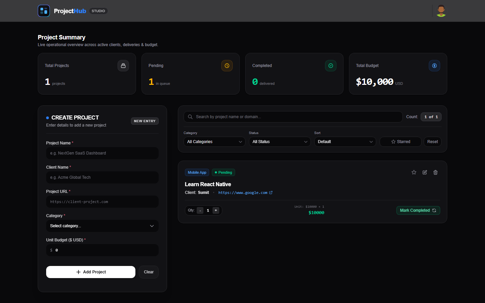

# ProjectHub

A dark-themed **Project & Client Dashboard** built with React + Vite + Tailwind CSS. Add projects, track budgets and statuses, and instantly search / filter / sort your list — all in one screen.



---

## Features

**Project Management**
- Add a new project with validation (name, client, URL, category, budget)
- Edit any project in place via the same form (add / edit modal)
- Delete projects with one click
- Toggle status between **Pending** ↔ **Completed**
- Increase / decrease quantity (`Qty`) — budget recalculates live (`unitBudget × unit`)

**Search, Filter & Sort** (all apply together)
- 🔍 Live search by **project name or domain**
- 🗂️ Filter by **Category** (Web, Mobile, UI/UX, Cloud, AI/ML, Branding)
- 📊 Filter by **Status** (Pending / Completed)
- ⭐ **Starred** toggle — show only favorites
- 🔀 Sort by **Name (A→Z / Z→A)** or **Budget (Low→High / High→Low)**
- ♻️ **Reset** button restores every control and brings back all projects
- Live counter: `shown of total`
- Empty state card with a quick **Reset Filters** action when nothing matches

**Summary Panel**
- Total projects, pending, completed and total budget cards — always computed from the **full** list, unaffected by filters

**UI / UX**
- Fully responsive (mobile → desktop), dark mode design
- Accessible controls (labels, `aria-pressed` on the starred toggle)

---

## Tech Stack

| Layer | Tool |
|---|---|
| UI library | React 19 |
| Build tool | Vite 8 |
| Styling | Tailwind CSS 4 (Vite plugin) |
| Linting | ESLint (flat config) |
| Extra libraries | **None** — filtering/sorting is plain React state |

---

## Getting Started

```bash
# 1. install dependencies
npm install

# 2. start dev server (with HMR)
npm run dev

# 3. production build
npm run build

# 4. preview the production build
npm run preview

# 5. lint the code
npm run lint
```

---

## File Structure

```
ProjectHub/
├── docs/
│   └── screenshot.png          # dashboard screenshot used above
├── public/
│   ├── favicon.svg
│   └── icons.svg
├── src/
│   ├── main.jsx                # entry point → mounts <App />
│   ├── App.jsx                 # layout shell: Header + Dashboard + Footer
│   ├── App.css                 # global/app styles
│   ├── index.css               # Tailwind + theme tokens
│   ├── Header.jsx              # top nav bar (logo + avatar)
│   ├── Footer.jsx              # footer
│   ├── assets/                 # images & icons (logo, avatar, empty-state…)
│   └── Project/                # 👇 all dashboard features live here
│       ├── Dashboard.jsx       # ⭐ state owner + filter/sort logic
│       ├── Summary.jsx         # section heading
│       ├── SummaryOverview.jsx # 4 stat cards
│       ├── AddorEditModal.jsx  # add / edit form with validation
│       ├── FilterSection.jsx   # search box, selects, starred, reset, count
│       ├── ProjectList.jsx     # renders the project cards
│       └── NotFound.jsx        # empty state ("no matching projects")
├── index.html
├── eslint.config.js
├── vite.config.js
└── package.json
```

### Component responsibilities

| Component | Role | Owns state? |
|---|---|---|
| `Dashboard` | Holds **all** app state and handlers; computes the visible list | ✅ `projects`, `search`, `category`, `status`, `sortBy`, `favoriteOnly` |
| `FilterSection` | Presentational — search box, dropdowns, buttons, count badge | ❌ controlled by props |
| `ProjectList` | Maps over the visible projects and renders cards | ❌ |
| `AddorEditModal` | Add/edit form + field validation | ✅ local form state only |
| `SummaryOverview` | Displays totals passed down from `Dashboard` | ❌ |
| `NotFound` | Empty state + Reset button | ❌ |

---

## Data Flow

**One-way data flow** — state lives only in `Dashboard` and travels *down* as props; user actions travel *up* through callback functions.

```
                    ┌──────────────────────────────┐
                    │         Dashboard            │
                    │  state:                      │
                    │   projects[]  (source data)  │
                    │   search, category, status,  │
                    │   sortBy, favoriteOnly       │
                    │                              │
                    │  getVisibleProjects(...)     │
                    │   1. filter  → 2. sort       │
                    └──────┬───────────────┬───────┘
              props ▼                    ▼ props
     ┌────────────────────┐   ┌──────────────────────┐
     │   FilterSection    │   │     ProjectList      │
     │ search/category/...│   │ visibleProjects[]    │
     └─────────┬──────────┘   └──────────┬───────────┘
               │ user types / clicks     │ star / edit / delete /
               ▼                         │ qty / status clicked
        callback props ──────────────────┘
               │
               ▼
     setSearch / setCategory / setStatus / setSortBy /
     setFavoriteOnly / toggleFavorite / deleteProject ...
               │
               ▼
        Dashboard re-renders → new props → UI updates
```

### Filter + sort pipeline

```js
projects (full list)
   │
   │  1. search match   → skip if the search box is empty
   │  2. category match → skip if "ALL"
   │  3. status match   → skip if "ALL"
   │  4. starred match  → skip if toggle is off
   │        (combined with &&  → every condition must pass)
   ▼
filtered[]
   │  copy array → sort by selected key (name / budget, asc / desc)
   ▼
visibleProjects  → rendered by <ProjectList />
```

- **Filter removes** items, **Sort reorders** what's left — they run in that order every render.
- The summary cards use `projects` (full list), so totals never change when you filter.

### Typical event walk-through

1. User picks `Status = Pending` → `FilterSection` calls `onStatusChange("Pending")`
2. `Dashboard` runs `setStatus("Pending")`
3. React re-renders → `getVisibleProjects()` returns only pending projects
4. New list flows down as props → `ProjectList` redraws, count badge updates
5. User clicks **Reset** → `resetAllFilters()` sets all 5 controls to defaults → every project is visible again

---

## License

Free to use for learning / assignment purposes.
